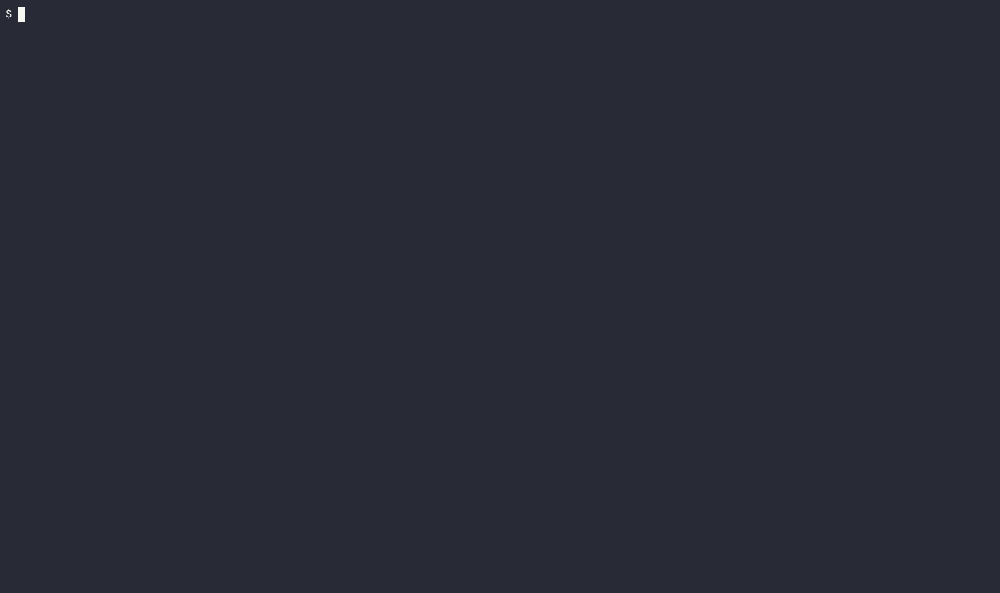

# Eraser: Cleaning up Images from Kubernetes Nodes

Eraser helps Kubernetes admins remove a list of non-running images from all Kubernetes nodes in a cluster.

## Getting started

You can find a quick start guide in the Eraser [documentation](https://azure.github.io/eraser/docs/quick-start).

## Demo

## Contributing

There are several ways to get involved:

- Join the [mailing list](https://groups.google.com/u/1/g/eraser-dev) to get notifications for releases, security announcements, etc.
- Join the [biweekly community meetings](https://docs.google.com/document/d/1Sj5u47K3WUGYNPmQHGFpb52auqZb1FxSlWAQnPADhWI/edit) to discuss development, issues, use cases, etc.
- Join the `#eraser` channel on the [Kubernetes Slack](https://kubernetes.slack.com/archives/C03Q8KV8YQ4)
- View the development setup instructions in the [documentation](https://azure.github.io/eraser/docs/setup)

This project welcomes contributions and suggestions. Most contributions require you to agree to a Contributor License Agreement (CLA) declaring that you have the right to, and actually do, grant us the rights to use your contribution. For details, visit https://cla.opensource.microsoft.com.

When you submit a pull request, a CLA bot will automatically determine whether you need to provide a CLA and decorate the PR appropriately (e.g., status check, comment). Simply follow the instructions provided by the bot. You will only need to do this once across all repos using our CLA.

This project has adopted the [Microsoft Open Source Code of Conduct](https://opensource.microsoft.com/codeofconduct/). For more information see the [Code of Conduct FAQ](https://opensource.microsoft.com/codeofconduct/faq/) or contact [opencode@microsoft.com](mailto:opencode@microsoft.com) with any additional questions or comments.

## Roadmap
You can view the public roadmap for Eraser on the GitHub Project [here](https://github.com/orgs/Azure/projects/441). Note that all target dates are aspirational and subject to change.

## Support

### How to file issues and get help

This project uses GitHub Issues to track bugs and feature requests. Please search the [existing issues](https://github.com/Azure/eraser/issues) before filing new issues to avoid duplicates. For new issues, file your bug or feature request as a new Issue.

The Eraser maintainers will respond to the best of their abilities.

### Microsoft Support Policy

Eraser is an open source project that is [**not** covered by the Microsoft Azure support policy](https://support.microsoft.com/en-us/help/2941892/support-for-linux-and-open-source-technology-in-azure). Support for the open source version of this project is limited to the resources listed above.

The [Image Cleaner addon](https://learn.microsoft.com/en-us/azure/aks/image-cleaner?tabs=azure-cli) for Azure Kubernetes Service is covered under the [Azure Support Policy](https://learn.microsoft.com/en-us/azure/aks/support-policies)

## Trademarks

This project may contain trademarks or logos for projects, products, or services. Authorized use of Microsoft trademarks or logos is subject to and must follow [Microsoft's Trademark & Brand Guidelines](https://www.microsoft.com/en-us/legal/intellectualproperty/trademarks/usage/general). Use of Microsoft trademarks or logos in modified versions of this project must not cause confusion or imply Microsoft sponsorship. Any use of third-party trademarks or logos are subject to those third-party's policies.
